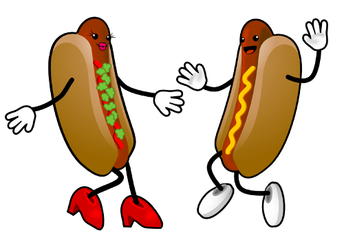

# Hot Diggity Dog!

Complete function [saleHotdogs], this function accepts 1 parameters:[n], n
is the number of customers to buy hotdogs, different numbers have different prices,
return a number that the customer needs to pay based on how many hot dogs purchased.
